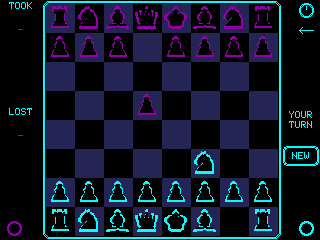

# xXCYD-ChessXx

Cyberpunk-themed chess with AI opponent for the ESP32 CYD. Touch play, custom piece art, dual color themes, and deep sleep — built on the CYD-Poker hardware layer.



## Features

- **Complete chess rules** — castling, en passant, pawn promotion (auto-queen)
- **AI opponent** — minimax with alpha-beta pruning, material + piece-square evaluation
- **Touch-based play** — tap to select, tap destination to move
- **Undo move** — left-arrow button below power button takes back last player + AI move pair
- **Save & resume** — press sleep (top-right) to save and deep sleep; tap to wake and resume exactly where you left off
- **Dual theme system** — 9 accent colors for the board/UI, 6 independent colors for AI pieces
- **Captured pieces display** — left panel shows taken/lost pieces
- **Check/Checkmate flash** — center-screen pulse animation (800ms, doesn't overstay)
- **2USB calibration** — interactive display + touch calibration on first boot
- **Deep sleep** — tap power button (top-right) to sleep, touch to wake

## Hardware

- ESP32-32E (1-USB) and 2USB CYD variants
- ILI9341 TFT display (320×240 landscape)
- XPT2046 touch controller
- Built with PlatformIO + TFT_eSPI

## Flash

| Board | Firmware |
|-------|----------|
| ESP32-32E (1-USB) | `CYD-Chess-1usb.bin` |
| CYD 2USB (all variants) | `CYD-Chess-2usb.bin` |

Merged images — flash at offset `0x00`:
```bash
esptool.py --chip esp32 write_flash 0x0 CYD-Chess-1usb.bin
```

Or use [M5Launcher](https://github.com/bmorcelli/M5Launcher) from SD card.

## Build

```bash
pio run -e cyd_chess        # 1-USB
pio run -e cyd_chess_2usb   # 2-USB
```

## How to Play

- You play **White** (bottom), AI plays **Black** (top)
- **Tap** a piece to select it — legal moves appear as colored dots
- **Tap** a legal destination to move
- AI responds automatically
- Bottom-right circle: cycle UI theme color
- Bottom-left circle: cycle AI piece color
- Top-right circle: deep sleep (saves game)
- Arrow below power button: undo last move

## Credits

Chess piece bitmaps from [maotek/ESP32-Chess](https://github.com/maotek/ESP32-Chess). Hardware layer ported from [CYD-Poker](https://github.com/xXQuantumSmokeXx/CYD-Poker). Built by xXQuantum-SmokeXx with Claude Code.
